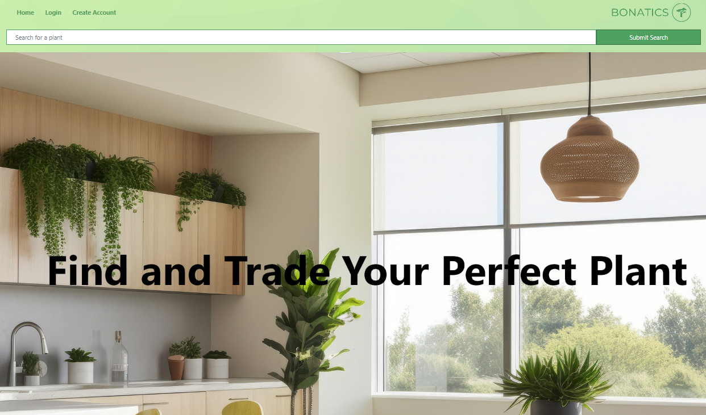

# Bonatics 

## Description

We created "Bonatics" for all plant enthusiasts who want to trade plants or discover new plants to add to their collection.  We want to create an online marketplace, similar to Etsy or Ebay to offer an alternative way of selling live plants. We know more and more people are interested in shopping for house-plants, but do not know what type of plants they should purchase or what is available.  Our website offers a space to discover what's available depending on the type of plant they're looking for and to expand their plant knowledge. 

## Installation

Our website is built using the MERN stack framework, with a Reactfront end, MongoDB database, and Node.js/Express.js server. 

The following npm packages are required on the client side to make application work:
- React
- Graphql
- Apollo Client
- React Dom
- React Router Dom
- JWT Decode
- React-bootstrap

The following npm packages are required on the server side to make application work:

- Apollo Server Express
- Graphql
- Json Web Token
- Mangoose
- MangoDB
- Bcrypt
- Express
- Node

Follow the steps below to get the development environment running:

 - Clone our project from github ( git clone git@github.com:SotoTheMayor/bonatics.git )
 - Install dependencies (npm install)
 - Run npm develop (to run client and server concurrently)

## Usage

Here is the link to our deployed application: 

Below is a screenshot of our webpage!

## Credits

This project was a joint collaboration between the following individuals:
 - Jason Johnson: https://github.com/SotoTheMayor
 - Kyle Oetjens: https://github.com/KyleOetjens
 - Sam Barsuhn: https://github.com/SBarsuhn
 - Aliya Jeylani: https://github.com/aliyajeylani
 - Kathryn Vlasic: https://github.com/katievlasic

## License

 This project uses MIT License which provides a further explanation on the usage under LICENSE
